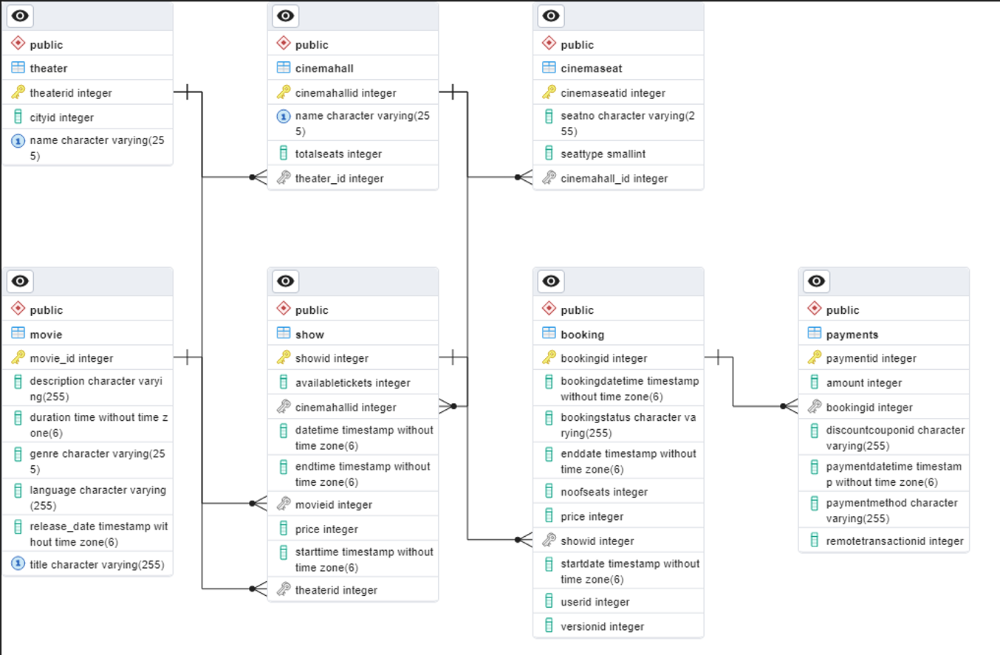
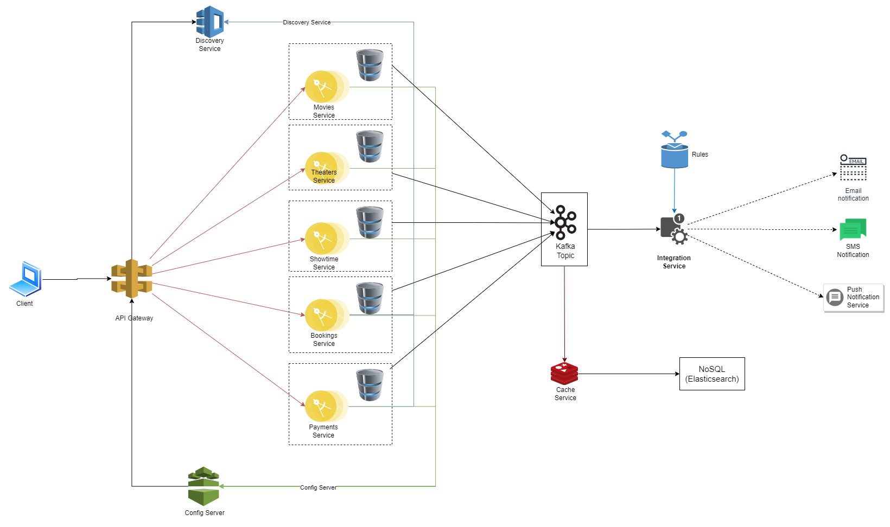

# booking-system

Set of micorservices to support following features
1. Add Theaters with one or many cinemahalls and seats.
2. Add Movies and their respective shows.
3. Booking service to book the respective show, movie and select desired seat.
4. payment service to allow thord party payment platforms

## Steps for execution

### Prerequisites
1. Need to run the docker instance of Zipkin
```
docker run -p 9411:9411 openzipkin/zipkin
```

2. Need to run kafka for event sourcing
use the below docker-compose.yml file
```
version: "2"

services:
  kafkaserver:
    image: "spotify/kafka:latest"
    container_name: kafka
    hostname: kafkaserver
    networks:
      - kafkanet
    ports:
      - 2181:2181
      - 9092:9092
    environment:
      ADVERTISED_HOST: kafkaserver
      ADVERTISED_PORT: 9092
  kafka_manager:
    image: "mzagar/kafka-manager-docker:1.3.3.4"
    container_name: kafkamanager
    networks:
      - kafkanet
    ports:
      - 9000:9000
    links:
      - kafkaserver
    environment:
      ZK_HOSTS: "kafkaserver:2181"

networks:
  kafkanet:
    driver: bridge
```
```
docker-compose up
```
Before trying to connect to kafka instance update hosts file
```
C:\Windows\System32\drivers\etc\hosts

Append this line:
127.0.0.1 kafkaserver
```


3. Start boot microservice in following order

| Service          | # Port running on |
|------------------|-------------------|
| zipkin           | 9411              |
| config-service   | 8888              |
| naming-service   | 8761              |
| api-gateway      | 8765              |
| movies-service   | 8081              |
| theaters-service | 8084              |
| showtime-service | 8086              |
| bookings-service | 8087              |

<hr/>
<details>
<summary> ERD Diagram </summary>

</details>
<hr/>
<details>
<summary> Architecture Diagram </summary>

</details>

<hr/>
Thanks
